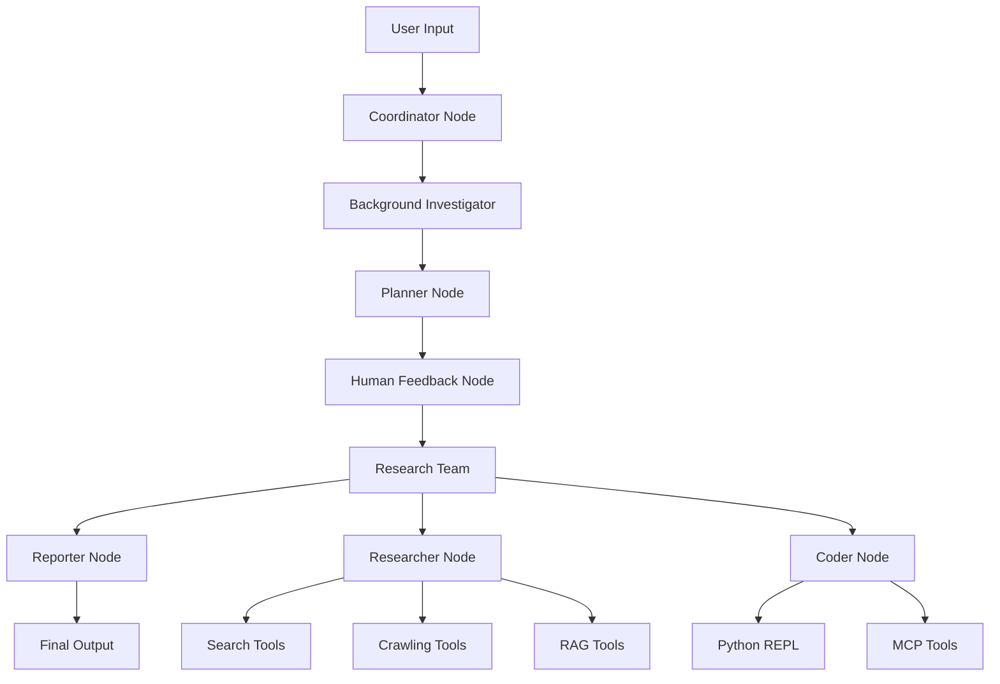

# DeerFlow Architecture Guide

> **For Developers**: Deep dive into DeerFlow's multi-agent system architecture, design patterns, and extensibility mechanisms.

## Table of Contents

- [Architecture Overview](#architecture-overview)
- [Core Components](#core-components)
- [State Management](#state-management)
- [Agent Orchestration](#agent-orchestration)
- [Tool Integration](#tool-integration)
- [Extension Points](#extension-points)
- [Performance Considerations](#performance-considerations)
- [Deployment Architecture](#deployment-architecture)

## Architecture Overview

DeerFlow implements a **state-driven multi-agent architecture** built on LangGraph, designed for scalable research automation and content generation. The system follows a **modular monolith pattern** with clear domain boundaries and plugin-based extensibility.

### Core Design Principles

1. **Declarative Workflows**: State transitions defined through LangGraph's StateGraph
2. **Agent Specialization**: Dedicated agents for specific domains (research, coding, planning)
3. **Pluggable Components**: Tool and LLM provider integration through standardized interfaces
4. **Human-in-Loop**: Interactive feedback mechanisms for plan refinement
5. **Fault Tolerance**: Graceful degradation and error recovery patterns

### High-Level Architecture



## Core Components

### 1. Graph Builder (`src/graph/builder.py`)

**Purpose**: Constructs the LangGraph state machine with proper node connections and flow control.

**Key Features**:
- **Node Registration**: Centralizes agent node definitions
- **Edge Management**: Defines state transition rules
- **Memory Integration**: Optional conversation persistence via MemorySaver
- **Conditional Routing**: Dynamic workflow paths based on state

```python
def build_graph():
    """Build and return the agent workflow graph without memory."""
    builder = StateGraph(State)
    builder.add_edge(START, "coordinator")
    builder.add_node("coordinator", coordinator_node)
    # ... additional nodes
    return builder.compile()
```

**Extension Points**:
- Add custom nodes via `builder.add_node()`
- Define routing logic in conditional edge functions
- Integrate custom checkpointing strategies

### 2. State Management (`src/graph/types.py`)

**Purpose**: Defines the shared state structure that flows through the agent workflow.

**State Schema**:
```python
class State(MessagesState):
    locale: str = "en-US"
    research_topic: str = ""
    observations: list[str] = []
    resources: list[Resource] = []
    plan_iterations: int = 0
    current_plan: Plan | str = None
    final_report: str = ""
    auto_accepted_plan: bool = False
    enable_background_investigation: bool = True
    background_investigation_results: str = None
```

**Design Benefits**:
- **Type Safety**: Pydantic-based validation
- **Extensibility**: Easy to add new state fields
- **Thread Safety**: Immutable state updates via Commands

### 3. Agent Nodes (`src/graph/nodes.py`)

**Purpose**: Implements the core business logic for each agent in the multi-agent system.

#### Coordinator Node
- **Role**: Entry point and workflow orchestration
- **Responsibilities**: User input parsing, locale detection, workflow routing
- **Tools**: `handoff_to_planner` for delegation

#### Planner Node
- **Role**: Strategic planning and task decomposition
- **Responsibilities**: Research plan generation, iteration management
- **LLM Integration**: Supports structured output and reasoning models

#### Research Team Nodes
- **Researcher Node**: Web search, content crawling, RAG integration
- **Coder Node**: Python execution, data analysis, technical tasks

#### Reporter Node
- **Role**: Final output generation and formatting
- **Responsibilities**: Aggregates findings, applies report styles, citation management

**Extension Pattern**:
```python
async def custom_node(state: State, config: RunnableConfig) -> Command:
    """Custom agent node implementation."""
    # 1. Extract state information
    # 2. Execute agent-specific logic
    # 3. Update state via Command
    # 4. Route to next node
    return Command(update={...}, goto="next_node")
```

## State Management

### State Flow Architecture

DeerFlow uses **immutable state updates** through LangGraph's Command system, ensuring thread safety and enabling distributed execution.

#### State Update Pattern
```python
return Command(
    update={
        "messages": [AIMessage(content=response)],
        "current_plan": validated_plan,
        "observations": observations + [new_observation]
    },
    goto="next_node"
)
```

#### State Persistence
- **Memory Mode**: `build_graph_with_memory()` for conversation persistence
- **Stateless Mode**: `build_graph()` for single-request execution
- **Custom Checkpointing**: Pluggable storage backends (SQLite, PostgreSQL planned)

### Configuration Management

#### Multi-Layer Configuration System
```
Environment Variables → conf.yaml → Runtime Config → Agent Settings
```

**Configuration Class** (`src/config/configuration.py`):
```python
@dataclass(kw_only=True)
class Configuration:
    resources: list[Resource] = field(default_factory=list)
    max_plan_iterations: int = 1
    max_step_num: int = 3
    max_search_results: int = 3
    mcp_settings: dict = None
    report_style: str = ReportStyle.ACADEMIC.value
    enable_deep_thinking: bool = False
```

## Agent Orchestration

### Workflow Execution Model

DeerFlow implements **event-driven agent coordination** where each node operates independently and communicates through shared state.

#### Execution Flow
1. **Coordinator**: Parses input, detects locale, routes to planner
2. **Background Investigator**: Performs initial research if enabled
3. **Planner**: Creates structured research plan
4. **Human Feedback**: Interactive plan review and refinement
5. **Research Team**: Executes plan steps via specialized agents
6. **Reporter**: Aggregates findings into final report

#### Agent Routing Logic
```python
def continue_to_running_research_team(state: State):
    """Dynamic routing based on current plan state."""
    current_plan = state.get("current_plan")
    if not current_plan or not current_plan.steps:
        return "planner"
    
    # Find first incomplete step
    incomplete_step = next(
        (step for step in current_plan.steps if not step.execution_res),
        None
    )
    
    if incomplete_step.step_type == StepType.RESEARCH:
        return "researcher"
    elif incomplete_step.step_type == StepType.PROCESSING:
        return "coder"
    return "planner"
```

### Agent Specialization

#### Tool Assignment Strategy
- **Researcher**: Search engines, crawlers, RAG systems
- **Coder**: Python REPL, data analysis libraries
- **Planner**: Structured output models, reasoning capabilities
- **Reporter**: Content generation models, formatting tools

#### MCP Integration Pattern
```python
async def _setup_and_execute_agent_step(
    state: State,
    config: RunnableConfig,
    agent_type: str,
    default_tools: list,
):
    """Dynamic tool loading based on MCP configuration."""
    if mcp_servers:
        client = MultiServerMCPClient(mcp_servers)
        loaded_tools = default_tools[:]
        all_tools = await client.get_tools()
        for tool in all_tools:
            if tool.name in enabled_tools:
                loaded_tools.append(tool)
        agent = create_agent(agent_type, loaded_tools)
    else:
        agent = create_agent(agent_type, default_tools)
    
    return await _execute_agent_step(state, agent, agent_type)
```

## Tool Integration

### Tool Architecture

DeerFlow implements a **plugin-based tool system** with standardized interfaces for easy extension.

#### Tool Categories

**Search Tools** (`src/tools/search.py`):
- Tavily (AI-optimized search)
- DuckDuckGo (privacy-focused)
- Brave Search (advanced features)
- ArXiv (scientific papers)

**Content Tools**:
- **Crawling** (`src/tools/crawl.py`): Jina AI reader integration
- **TTS** (`src/tools/tts.py`): Volcengine text-to-speech
- **Python REPL** (`src/tools/python_repl.py`): Code execution sandbox

**RAG Integration** (`src/rag/`):
- RAGFlow integration for private knowledge bases
- VikingDB vector storage
- Resource-based retrieval system

#### Tool Registration Pattern
```python
@tool
def custom_search_tool(
    query: Annotated[str, "Search query"],
    max_results: Annotated[int, "Maximum results"] = 3
) -> str:
    """Custom search tool implementation."""
    # Tool implementation
    return search_results
```

### MCP (Model Context Protocol) Integration

#### Dynamic Tool Loading
```python
# MCP server configuration
mcp_settings = {
    "servers": {
        "github-trending": {
            "transport": "stdio",
            "command": "uvx",
            "args": ["mcp-github-trending"],
            "enabled_tools": ["get_github_trending_repositories"],
            "add_to_agents": ["researcher"]
        }
    }
}
```

#### Tool Routing Strategy
- **Agent-Specific**: Tools assigned to specific agent types
- **Dynamic Loading**: Runtime tool discovery and registration
- **Fallback Handling**: Graceful degradation when tools unavailable

## Extension Points

### Adding Custom Agents

#### 1. Define Agent Node Function
```python
async def custom_agent_node(
    state: State, 
    config: RunnableConfig
) -> Command[Literal["next_node"]]:
    """Custom agent implementation."""
    # Extract state information
    current_task = state.get("current_task")
    
    # Execute agent logic
    result = await execute_custom_logic(current_task)
    
    # Update state and route
    return Command(
        update={"custom_result": result},
        goto="next_node"
    )
```

#### 2. Register in Graph Builder
```python
def build_custom_graph():
    builder = StateGraph(State)
    # ... existing nodes
    builder.add_node("custom_agent", custom_agent_node)
    builder.add_edge("planner", "custom_agent")
    builder.add_edge("custom_agent", "reporter")
    return builder.compile()
```

### Custom Tool Development

#### Tool Interface Implementation
```python
from langchain_core.tools import tool
from typing import Annotated

@tool
def custom_analysis_tool(
    data: Annotated[str, "Input data for analysis"],
    method: Annotated[str, "Analysis method"] = "standard"
) -> str:
    """Perform custom data analysis."""
    # Implementation
    return analysis_results
```

#### Tool Registration
```python
# Add to agent tools list
custom_tools = [custom_analysis_tool, existing_tool1, existing_tool2]
agent = create_agent("custom_agent", custom_tools)
```

### LLM Provider Integration

#### Custom Provider Configuration
```yaml
# conf.yaml
CUSTOM_MODEL:
  base_url: "https://your-api-endpoint.com/v1"
  model: "custom-model-name"
  api_key: "${CUSTOM_API_KEY}"
  verify_ssl: true
  timeout: 30
```

#### Provider Registration
```python
# In src/llms/llm.py
def get_custom_llm():
    """Initialize custom LLM provider."""
    config = load_model_config("CUSTOM_MODEL")
    return CustomChatModel(
        base_url=config.base_url,
        model=config.model,
        api_key=config.api_key
    )
```

## Performance Considerations

### Scalability Patterns

#### Asynchronous Execution
- **Agent Nodes**: Full async/await support
- **Tool Calls**: Concurrent tool execution where possible
- **Streaming**: Real-time response generation via SSE

#### Resource Management
```python
# Configurable limits
AGENT_RECURSION_LIMIT = 25  # Max tool call depth
max_plan_iterations = 3     # Plan refinement cycles
max_search_results = 5      # Search result limits
```

#### Caching Strategies
- **Tool Results**: Cache search and crawl results
- **LLM Responses**: Cache for repeated queries
- **State Snapshots**: Checkpoint intermediate results

### Performance Optimization

#### Memory Usage
- **State Immutability**: Prevents memory leaks
- **Tool Cleanup**: Proper resource disposal
- **Streaming Responses**: Reduces memory footprint

#### Network Optimization
- **Connection Pooling**: Reuse HTTP connections
- **Request Batching**: Group API calls where possible
- **Timeout Configuration**: Prevent hanging requests

## Deployment Architecture

### Container Strategy

#### Multi-Stage Docker Build
```dockerfile
FROM ghcr.io/astral-sh/uv:python3.12-bookworm

# Pre-cache dependencies
RUN --mount=type=cache,target=/root/.cache/uv \
    --mount=type=bind,source=uv.lock,target=uv.lock \
    uv sync --locked --no-install-project

# Application layer
COPY . /app
RUN uv sync --locked

EXPOSE 8000
CMD ["uv", "run", "python", "server.py"]
```

#### Docker Compose Configuration
```yaml
services:
  deer-flow-api:
    build: .
    environment:
      - SEARCH_API=tavily
      - TAVILY_API_KEY=${TAVILY_API_KEY}
    ports:
      - "8000:8000"
    
  deer-flow-web:
    build: ./web
    ports:
      - "3000:3000"
    depends_on:
      - deer-flow-api
```

### Production Considerations

#### Security
- **Environment Variables**: Secure secret management
- **CORS Configuration**: Restricted origins in production
- **Input Validation**: Pydantic model validation
- **MCP Sandboxing**: Isolated tool execution

#### Monitoring
- **Structured Logging**: Agent-specific log namespaces
- **Performance Metrics**: Request duration, token usage
- **Error Tracking**: Exception capture and reporting
- **Health Checks**: Endpoint availability monitoring

#### High Availability
- **Stateless Design**: Horizontal scaling capability
- **Load Balancing**: Multiple instance deployment
- **Circuit Breakers**: Fail-fast for degraded services
- **Graceful Shutdown**: Proper resource cleanup

## Best Practices

### Development Guidelines

1. **State Updates**: Always use Command pattern for state modifications
2. **Error Handling**: Implement graceful degradation for all external calls
3. **Tool Development**: Follow standardized tool interface patterns
4. **Testing**: Write unit tests for agent nodes and integration tests for workflows
5. **Documentation**: Maintain inline documentation for complex logic

### Operational Guidelines

1. **Configuration**: Use environment-specific configuration files
2. **Monitoring**: Implement comprehensive logging and metrics
3. **Scaling**: Design for horizontal scalability from the start
4. **Security**: Apply defense-in-depth principles
5. **Maintenance**: Regular updates for dependencies and security patches

---

For more detailed implementation examples, see the `/examples` directory in the repository.