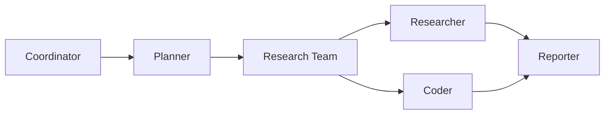

# DeerFlow Developer Guide: Multi-Agent System

> **Professional Development Guide**: Comprehensive reference for building, extending, and maintaining DeerFlow's multi-agent research automation system.

## Table of Contents

- [Introduction to Multi-Agent Architecture](#introduction-to-multi-agent-architecture)
- [Getting Started with Development](#getting-started-with-development)
- [Agent Development Patterns](#agent-development-patterns)
- [State Management Best Practices](#state-management-best-practices)
- [Tool Integration Framework](#tool-integration-framework)
- [Testing Multi-Agent Systems](#testing-multi-agent-systems)
- [Production Deployment](#production-deployment)
- [Advanced Topics](#advanced-topics)
- [Troubleshooting Guide](#troubleshooting-guide)

## Introduction to Multi-Agent Architecture

DeerFlow's multi-agent system is built on **LangGraph**, providing a declarative approach to orchestrating specialized AI agents. Each agent operates independently while sharing state through a centralized message-passing system.

### Core Architecture Philosophy

The system implements a **choreographed coordination pattern** where agents operate autonomously but follow a predefined workflow structure. This approach provides:

- **Scalability**: Independent agent execution enables horizontal scaling
- **Maintainability**: Clear separation of concerns and responsibilities
- **Flexibility**: Easy addition of new agents and tools
- **Fault Tolerance**: Graceful degradation when individual agents fail

### Agent Specialization Model



Each agent has specialized capabilities:
- **Coordinator**: User input processing and workflow initiation
- **Planner**: Task decomposition and strategic planning
- **Researcher**: Information gathering and web search
- **Coder**: Data analysis and Python execution
- **Reporter**: Content synthesis and formatting

## Getting Started with Development

### Development Environment Setup

#### Prerequisites
```bash
# Required tools
Python 3.12+
Node.js 22+ (for web UI)
uv (Python package manager)
Docker (for containerized development)
```

#### Local Development Setup
```bash
# Clone and setup
git clone https://github.com/bytedance/deer-flow.git
cd deer-flow

# Install Python dependencies
uv sync

# Configure environment
cp .env.example .env
cp conf.yaml.example conf.yaml

# Start development servers
./bootstrap.sh -d  # macOS/Linux
# or
bootstrap.bat -d   # Windows
```

#### Development Workflow
1. **Backend Changes**: Modify Python code in `src/`
2. **Frontend Changes**: Edit React/TypeScript in `web/src/`
3. **Testing**: Run `make test` for Python tests
4. **Linting**: Use `make lint` and `make format`
5. **Documentation**: Update relevant `.md` files

### Project Structure Deep Dive

```
src/
├── agents/           # Agent creation and configuration
├── config/           # Configuration management
├── crawler/          # Web content extraction
├── graph/           # LangGraph state machine
├── llms/            # Language model integrations
├── podcast/         # Audio content generation
├── ppt/             # Presentation generation
├── prompts/         # Prompt templates and models
├── prose/           # Text manipulation
├── rag/             # Retrieval-augmented generation
├── server/          # FastAPI web server
├── tools/           # Tool implementations
└── utils/           # Utility functions
```

## Agent Development Patterns

### Creating Custom Agents

#### 1. Agent Node Implementation Pattern

```python
from typing import Literal
from langchain_core.runnables import RunnableConfig
from langgraph.types import Command

from src.graph.types import State

async def custom_agent_node(
    state: State, 
    config: RunnableConfig
) -> Command[Literal["next_node", "error_handler"]]:
    """
    Custom agent implementation following DeerFlow patterns.
    
    Args:
        state: Current workflow state
        config: Runtime configuration
        
    Returns:
        Command with state updates and routing decision
    """
    logger = logging.getLogger(__name__)
    logger.info("Custom agent executing")
    
    try:
        # 1. Extract relevant state information
        current_task = state.get("current_task")
        observations = state.get("observations", [])
        
        # 2. Execute agent-specific logic
        result = await execute_custom_logic(
            task=current_task,
            config=Configuration.from_runnable_config(config)
        )
        
        # 3. Update state and route to next node
        return Command(
            update={
                "observations": observations + [result],
                "custom_agent_result": result
            },
            goto="next_node"
        )
        
    except Exception as e:
        logger.error(f"Custom agent error: {e}")
        return Command(
            update={"error": str(e)},
            goto="error_handler"
        )
```

#### 2. Agent Registration in Graph Builder

```python
# In src/graph/builder.py
def build_custom_graph():
    """Extended graph builder with custom agent."""
    builder = StateGraph(State)
    
    # Standard nodes
    builder.add_node("coordinator", coordinator_node)
    builder.add_node("planner", planner_node)
    
    # Custom agent node
    builder.add_node("custom_agent", custom_agent_node)
    
    # Define edges
    builder.add_edge("planner", "custom_agent")
    builder.add_edge("custom_agent", "reporter")
    
    return builder.compile()
```

#### 3. Agent Configuration Integration

```python
# In src/config/agents.py
AGENT_LLM_MAP = {
    "coordinator": "basic",
    "planner": "basic",
    "researcher": "basic", 
    "coder": "basic",
    "reporter": "basic",
    "custom_agent": "advanced"  # New agent configuration
}

# Custom agent tools
CUSTOM_AGENT_TOOLS = [
    "custom_analysis_tool",
    "data_visualization_tool",
    "report_generator"
]
```

### Advanced Agent Patterns

#### Agent with Tool Integration
```python
from src.tools import get_web_search_tool, crawl_tool

async def research_specialist_node(state: State, config: RunnableConfig):
    """Specialized research agent with multiple tools."""
    configurable = Configuration.from_runnable_config(config)
    
    # Configure tools based on agent requirements
    tools = [
        get_web_search_tool(configurable.max_search_results),
        crawl_tool,
        get_retriever_tool(state.get("resources", []))
    ]
    
    # Add MCP tools if available
    if configurable.mcp_settings:
        mcp_tools = await load_mcp_tools_for_agent(
            "research_specialist", 
            configurable.mcp_settings
        )
        tools.extend(mcp_tools)
    
    # Create agent with tools
    agent = create_agent("research_specialist", tools)
    
    # Execute with proper error handling
    return await execute_agent_with_retry(
        agent, state, max_retries=3
    )
```

#### Multi-Step Agent Processing
```python
async def complex_analysis_agent(state: State, config: RunnableConfig):
    """Agent implementing multi-step analysis workflow."""
    current_plan = state.get("current_plan")
    results = []
    
    for step in current_plan.steps:
        if step.requires_analysis:
            # Step 1: Data collection
            data = await collect_data(step.data_sources)
            
            # Step 2: Analysis execution
            analysis = await perform_analysis(data, step.analysis_type)
            
            # Step 3: Result validation
            validated_result = await validate_results(analysis)
            
            results.append({
                "step_id": step.id,
                "result": validated_result,
                "confidence": calculate_confidence(validated_result)
            })
    
    return Command(
        update={
            "analysis_results": results,
            "analysis_complete": True
        },
        goto="reporter"
    )
```

## State Management Best Practices

### State Schema Design

#### Extending Base State
```python
from src.graph.types import State as BaseState

class ExtendedState(BaseState):
    """Extended state with custom fields."""
    
    # Custom agent results
    custom_analysis: dict = None
    processing_metrics: dict = None
    
    # Workflow control
    retry_count: int = 0
    error_recovery_mode: bool = False
    
    # Performance tracking
    agent_execution_times: dict = None
    resource_usage: dict = None
```

#### State Update Patterns
```python
# ✅ Correct: Immutable updates
return Command(
    update={
        "observations": state.get("observations", []) + [new_observation],
        "metrics": {**state.get("metrics", {}), "new_metric": value}
    },
    goto="next_node"
)

# ❌ Incorrect: Direct state mutation
state["observations"].append(new_observation)  # Don't do this
```

#### State Validation
```python
from pydantic import validator

class ValidatedState(BaseState):
    """State with validation rules."""
    
    @validator('plan_iterations')
    def validate_plan_iterations(cls, v):
        if v < 0:
            raise ValueError('Plan iterations must be non-negative')
        return v
    
    @validator('current_plan')
    def validate_current_plan(cls, v):
        if v and not hasattr(v, 'steps'):
            raise ValueError('Plan must have steps attribute')
        return v
```

### Advanced State Patterns

#### Conditional State Updates
```python
def conditional_state_update(state: State, condition_result: bool):
    """Update state based on conditions."""
    base_update = {"processed": True}
    
    if condition_result:
        base_update.update({
            "success_path": True,
            "next_action": "continue_processing"
        })
    else:
        base_update.update({
            "success_path": False,
            "next_action": "error_recovery",
            "retry_count": state.get("retry_count", 0) + 1
        })
    
    return Command(update=base_update, goto="next_node")
```

#### State Persistence Patterns
```python
# Custom checkpointer implementation
from langgraph.checkpoint import BaseCheckpointSaver

class CustomCheckpointSaver(BaseCheckpointSaver):
    """Custom state persistence implementation."""
    
    def __init__(self, connection_string: str):
        self.connection_string = connection_string
    
    async def aget_tuple(self, config: RunnableConfig) -> CheckpointTuple:
        # Implement state retrieval logic
        pass
    
    async def aput(self, config: RunnableConfig, checkpoint: Checkpoint):
        # Implement state persistence logic
        pass
```

## Tool Integration Framework

### Creating Custom Tools

#### Basic Tool Implementation
```python
from langchain_core.tools import tool
from typing import Annotated

@tool
def data_analysis_tool(
    dataset: Annotated[str, "Path to dataset or data content"],
    analysis_type: Annotated[str, "Type of analysis: 'statistical', 'trend', 'correlation'"] = "statistical",
    output_format: Annotated[str, "Output format: 'summary', 'detailed', 'json'"] = "summary"
) -> str:
    """
    Perform comprehensive data analysis on provided dataset.
    
    This tool supports multiple analysis types and output formats,
    making it suitable for various research scenarios.
    """
    try:
        # Load and validate data
        data = load_dataset(dataset)
        validate_data_format(data)
        
        # Perform analysis based on type
        if analysis_type == "statistical":
            result = perform_statistical_analysis(data)
        elif analysis_type == "trend":
            result = perform_trend_analysis(data)
        elif analysis_type == "correlation":
            result = perform_correlation_analysis(data)
        else:
            raise ValueError(f"Unsupported analysis type: {analysis_type}")
        
        # Format output
        return format_analysis_result(result, output_format)
        
    except Exception as e:
        return f"Analysis error: {str(e)}"
```

#### Advanced Tool with Configuration
```python
from dataclasses import dataclass

@dataclass
class AdvancedToolConfig:
    """Configuration for advanced tools."""
    timeout_seconds: int = 30
    retry_attempts: int = 3
    cache_results: bool = True
    log_level: str = "INFO"

@tool
def advanced_web_crawler(
    url: Annotated[str, "URL to crawl"],
    config: Annotated[AdvancedToolConfig, "Tool configuration"] = None
) -> str:
    """Advanced web crawling with configuration support."""
    config = config or AdvancedToolConfig()
    
    logger = logging.getLogger(__name__)
    logger.setLevel(getattr(logging, config.log_level))
    
    for attempt in range(config.retry_attempts):
        try:
            # Crawling logic with timeout
            result = crawl_with_timeout(url, config.timeout_seconds)
            
            if config.cache_results:
                cache_result(url, result)
            
            return result
            
        except Exception as e:
            logger.warning(f"Crawl attempt {attempt + 1} failed: {e}")
            if attempt == config.retry_attempts - 1:
                return f"Crawling failed after {config.retry_attempts} attempts"
```

### Tool Registration and Management

#### Dynamic Tool Loading
```python
def load_tools_for_agent(agent_type: str, tool_config: dict) -> list:
    """Dynamically load tools based on agent type and configuration."""
    tools = []
    
    # Base tools for all agents
    base_tools = get_base_tools()
    tools.extend(base_tools)
    
    # Agent-specific tools
    if agent_type == "researcher":
        tools.extend([
            get_web_search_tool(tool_config.get("max_results", 5)),
            crawl_tool,
            get_retriever_tool(tool_config.get("resources", []))
        ])
    elif agent_type == "coder":
        tools.extend([
            python_repl_tool,
            data_analysis_tool,
            visualization_tool
        ])
    
    # Custom tools from configuration
    custom_tools = tool_config.get("custom_tools", [])
    for tool_name in custom_tools:
        tool = load_custom_tool(tool_name)
        if tool:
            tools.append(tool)
    
    return tools
```

#### Tool Performance Monitoring
```python
from functools import wraps
import time

def monitor_tool_performance(tool_func):
    """Decorator to monitor tool execution performance."""
    @wraps(tool_func)
    def wrapper(*args, **kwargs):
        start_time = time.time()
        
        try:
            result = tool_func(*args, **kwargs)
            execution_time = time.time() - start_time
            
            # Log performance metrics
            logger.info(f"Tool {tool_func.__name__} executed in {execution_time:.2f}s")
            
            # Store metrics for analysis
            store_tool_metrics(tool_func.__name__, execution_time, "success")
            
            return result
            
        except Exception as e:
            execution_time = time.time() - start_time
            store_tool_metrics(tool_func.__name__, execution_time, "error")
            raise
    
    return wrapper
```

## Testing Multi-Agent Systems

### Unit Testing Agent Nodes

#### Agent Node Test Pattern
```python
import pytest
from unittest.mock import Mock, patch
from src.graph.nodes import researcher_node
from src.graph.types import State

@pytest.mark.asyncio
async def test_researcher_node_success():
    """Test successful researcher node execution."""
    # Arrange
    mock_state = State(
        research_topic="AI applications in healthcare",
        current_plan=Mock(steps=[Mock(execution_res=None, title="Research step")])
    )
    mock_config = Mock()
    
    # Mock tool responses
    with patch('src.tools.get_web_search_tool') as mock_search:
        mock_search.return_value.invoke.return_value = "Search results"
        
        # Act
        result = await researcher_node(mock_state, mock_config)
        
        # Assert
        assert isinstance(result, Command)
        assert "observations" in result.update
        assert len(result.update["observations"]) > 0
```

#### Integration Testing Workflow
```python
@pytest.mark.integration
async def test_complete_workflow():
    """Test complete multi-agent workflow integration."""
    # Setup
    initial_state = {
        "messages": [{"role": "user", "content": "Research quantum computing"}],
        "auto_accepted_plan": True
    }
    
    config = {
        "configurable": {
            "thread_id": "test_thread",
            "max_plan_iterations": 1,
            "max_step_num": 2
        }
    }
    
    # Execute workflow
    graph = build_graph()
    final_state = None
    
    async for state in graph.astream(initial_state, config=config):
        final_state = state
    
    # Verify workflow completion
    assert final_state is not None
    assert "final_report" in final_state
    assert len(final_state["final_report"]) > 0
```

### Load Testing and Performance

#### Agent Performance Testing
```python
import asyncio
import time
from concurrent.futures import ThreadPoolExecutor

async def test_agent_performance():
    """Test agent performance under load."""
    test_cases = [
        {"topic": "AI in healthcare", "complexity": "simple"},
        {"topic": "Quantum computing algorithms", "complexity": "complex"},
        {"topic": "Climate change solutions", "complexity": "medium"}
    ]
    
    start_time = time.time()
    
    # Execute multiple workflows concurrently
    tasks = []
    for test_case in test_cases:
        task = execute_workflow_async(test_case)
        tasks.append(task)
    
    results = await asyncio.gather(*tasks)
    
    total_time = time.time() - start_time
    
    # Analyze performance
    assert total_time < 60  # Should complete within 60 seconds
    assert all(result.get("final_report") for result in results)
    
    print(f"Processed {len(test_cases)} workflows in {total_time:.2f} seconds")
```

## Production Deployment

### Configuration Management

#### Environment-Specific Configurations
```yaml
# production.yaml
BASIC_MODEL:
  base_url: "${PRODUCTION_LLM_ENDPOINT}"
  model: "gpt-4o"
  api_key: "${PRODUCTION_API_KEY}"
  timeout: 30
  retry_attempts: 3

SEARCH_ENGINE:
  engine: tavily
  api_key: "${TAVILY_PRODUCTION_KEY}"
  max_results: 5
  timeout: 15

SECURITY:
  enable_auth: true
  cors_origins: 
    - "https://your-domain.com"
    - "https://api.your-domain.com"
  rate_limit: 100  # requests per minute
```

#### Configuration Validation
```python
from pydantic import BaseModel, validator

class ProductionConfig(BaseModel):
    """Production configuration with validation."""
    
    llm_endpoint: str
    api_key: str
    max_concurrent_requests: int = 10
    enable_monitoring: bool = True
    
    @validator('llm_endpoint')
    def validate_endpoint(cls, v):
        if not v.startswith(('http://', 'https://')):
            raise ValueError('Endpoint must be a valid URL')
        return v
    
    @validator('max_concurrent_requests')
    def validate_concurrency(cls, v):
        if v < 1 or v > 100:
            raise ValueError('Concurrent requests must be between 1 and 100')
        return v
```

### Monitoring and Observability

#### Custom Metrics Collection
```python
from prometheus_client import Counter, Histogram, start_http_server

# Define metrics
agent_executions = Counter('agent_executions_total', 'Total agent executions', ['agent_type', 'status'])
execution_duration = Histogram('agent_execution_seconds', 'Agent execution time', ['agent_type'])

def track_agent_execution(agent_type: str):
    """Decorator to track agent execution metrics."""
    def decorator(func):
        @wraps(func)
        async def wrapper(*args, **kwargs):
            with execution_duration.labels(agent_type=agent_type).time():
                try:
                    result = await func(*args, **kwargs)
                    agent_executions.labels(agent_type=agent_type, status='success').inc()
                    return result
                except Exception as e:
                    agent_executions.labels(agent_type=agent_type, status='error').inc()
                    raise
        return wrapper
    return decorator
```

#### Health Check Implementation
```python
from fastapi import FastAPI
from fastapi.responses import JSONResponse

@app.get("/health")
async def health_check():
    """Comprehensive health check endpoint."""
    health_status = {
        "status": "healthy",
        "timestamp": datetime.utcnow().isoformat(),
        "services": {}
    }
    
    # Check LLM connectivity
    try:
        test_llm = get_llm_by_type("basic")
        await test_llm.ainvoke("test")
        health_status["services"]["llm"] = "healthy"
    except Exception:
        health_status["services"]["llm"] = "unhealthy"
        health_status["status"] = "degraded"
    
    # Check search service
    try:
        search_tool = get_web_search_tool(1)
        await search_tool.ainvoke("test query")
        health_status["services"]["search"] = "healthy"
    except Exception:
        health_status["services"]["search"] = "unhealthy"
        health_status["status"] = "degraded"
    
    return JSONResponse(
        content=health_status,
        status_code=200 if health_status["status"] == "healthy" else 503
    )
```

### Scaling Strategies

#### Horizontal Scaling Pattern
```python
from concurrent.futures import ThreadPoolExecutor
import asyncio

class AgentPoolManager:
    """Manages a pool of agent executors for horizontal scaling."""
    
    def __init__(self, max_workers: int = 10):
        self.executor = ThreadPoolExecutor(max_workers=max_workers)
        self.active_tasks = {}
    
    async def execute_workflow(self, workflow_id: str, initial_state: dict):
        """Execute workflow in thread pool."""
        loop = asyncio.get_event_loop()
        
        future = self.executor.submit(
            self._execute_workflow_sync, 
            workflow_id, 
            initial_state
        )
        
        self.active_tasks[workflow_id] = future
        
        try:
            result = await loop.run_in_executor(None, future.result)
            return result
        finally:
            del self.active_tasks[workflow_id]
    
    def _execute_workflow_sync(self, workflow_id: str, initial_state: dict):
        """Synchronous workflow execution."""
        graph = build_graph()
        final_state = graph.invoke(initial_state)
        return final_state
```

## Advanced Topics

### Custom LLM Provider Integration

#### Provider Implementation Pattern
```python
from langchain_core.language_models import BaseChatModel
from langchain_core.messages import BaseMessage

class CustomLLMProvider(BaseChatModel):
    """Custom LLM provider implementation."""
    
    def __init__(self, api_endpoint: str, api_key: str, **kwargs):
        super().__init__(**kwargs)
        self.api_endpoint = api_endpoint
        self.api_key = api_key
    
    def _call(self, messages: List[BaseMessage], **kwargs) -> str:
        """Synchronous call implementation."""
        # Implement API call logic
        pass
    
    async def _acall(self, messages: List[BaseMessage], **kwargs) -> str:
        """Asynchronous call implementation."""
        # Implement async API call logic
        pass
    
    @property
    def _llm_type(self) -> str:
        return "custom_llm"
```

### Advanced MCP Integration

#### Custom MCP Server Implementation
```python
import mcp.server.stdio
from mcp.server import Server
from mcp.types import Tool

# Create MCP server
server = Server("custom-tools-server")

@server.list_tools()
async def list_tools() -> list[Tool]:
    """List available tools."""
    return [
        Tool(
            name="custom_analysis",
            description="Perform custom data analysis",
            inputSchema={
                "type": "object",
                "properties": {
                    "data": {"type": "string"},
                    "method": {"type": "string"}
                }
            }
        )
    ]

@server.call_tool()
async def call_tool(name: str, arguments: dict):
    """Execute tool calls."""
    if name == "custom_analysis":
        return await perform_custom_analysis(
            arguments["data"], 
            arguments["method"]
        )
    else:
        raise ValueError(f"Unknown tool: {name}")

# Run server
if __name__ == "__main__":
    mcp.server.stdio.run(server)
```

### Performance Optimization

#### Caching Implementation
```python
from functools import lru_cache
import redis
import json

class DistributedCache:
    """Redis-based distributed caching for agent results."""
    
    def __init__(self, redis_url: str):
        self.redis_client = redis.from_url(redis_url)
    
    def get(self, key: str):
        """Get cached value."""
        cached_value = self.redis_client.get(key)
        return json.loads(cached_value) if cached_value else None
    
    def set(self, key: str, value, ttl: int = 3600):
        """Set cached value with TTL."""
        self.redis_client.setex(
            key, 
            ttl, 
            json.dumps(value, default=str)
        )

# Usage in agent nodes
cache = DistributedCache("redis://localhost:6379")

async def cached_researcher_node(state: State, config: RunnableConfig):
    """Researcher node with caching support."""
    query = state.get("research_topic")
    cache_key = f"research:{hash(query)}"
    
    # Check cache first
    cached_result = cache.get(cache_key)
    if cached_result:
        return Command(
            update={"observations": [cached_result]},
            goto="planner"
        )
    
    # Execute research if not cached
    result = await execute_research(query)
    
    # Cache result
    cache.set(cache_key, result)
    
    return Command(
        update={"observations": [result]},
        goto="planner"
    )
```

## Troubleshooting Guide

### Common Issues and Solutions

#### Agent Execution Timeouts
```python
# Problem: Agent taking too long to execute
# Solution: Implement timeout handling

import asyncio

async def execute_with_timeout(agent_func, *args, timeout=30, **kwargs):
    """Execute agent function with timeout."""
    try:
        result = await asyncio.wait_for(
            agent_func(*args, **kwargs),
            timeout=timeout
        )
        return result
    except asyncio.TimeoutError:
        logger.error(f"Agent execution timed out after {timeout} seconds")
        return Command(
            update={"error": "Agent execution timeout"},
            goto="error_handler"
        )
```

#### State Corruption Issues
```python
# Problem: State getting corrupted during updates
# Solution: Implement state validation

from copy import deepcopy

def validate_state_update(old_state: State, new_update: dict) -> dict:
    """Validate state updates before applying."""
    # Create a copy to test the update
    test_state = deepcopy(old_state)
    
    try:
        # Apply update to test copy
        for key, value in new_update.items():
            setattr(test_state, key, value)
        
        # Validate the resulting state
        if not hasattr(test_state, 'messages'):
            raise ValueError("State must have messages field")
        
        if test_state.plan_iterations < 0:
            raise ValueError("Plan iterations cannot be negative")
        
        return new_update
        
    except Exception as e:
        logger.error(f"State validation failed: {e}")
        # Return safe fallback update
        return {"error": str(e)}
```

#### Memory Issues with Large Workflows
```python
# Problem: Memory usage growing with long workflows
# Solution: Implement state cleanup

def cleanup_state_for_memory(state: State) -> dict:
    """Clean up state to reduce memory usage."""
    # Keep only essential information for next steps
    essential_state = {
        "current_plan": state.get("current_plan"),
        "locale": state.get("locale"),
        "research_topic": state.get("research_topic")
    }
    
    # Keep only recent observations (last 5)
    observations = state.get("observations", [])
    if len(observations) > 5:
        essential_state["observations"] = observations[-5:]
    else:
        essential_state["observations"] = observations
    
    return essential_state
```

### Debugging Tools

#### Agent Execution Tracer
```python
class AgentExecutionTracer:
    """Tool for tracing agent execution flow."""
    
    def __init__(self):
        self.execution_log = []
    
    def trace_entry(self, agent_name: str, state_snapshot: dict):
        """Log agent entry point."""
        self.execution_log.append({
            "timestamp": datetime.utcnow().isoformat(),
            "event": "agent_entry",
            "agent": agent_name,
            "state_keys": list(state_snapshot.keys())
        })
    
    def trace_exit(self, agent_name: str, result: Command):
        """Log agent exit point."""
        self.execution_log.append({
            "timestamp": datetime.utcnow().isoformat(),
            "event": "agent_exit", 
            "agent": agent_name,
            "goto": result.goto,
            "update_keys": list(result.update.keys()) if result.update else []
        })
    
    def export_trace(self) -> str:
        """Export execution trace for analysis."""
        return json.dumps(self.execution_log, indent=2)

# Usage in development
tracer = AgentExecutionTracer()

async def traced_agent_node(state: State, config: RunnableConfig):
    """Agent node with execution tracing."""
    tracer.trace_entry("agent_name", state.dict())
    
    result = await original_agent_logic(state, config)
    
    tracer.trace_exit("agent_name", result)
    return result
```

### Performance Profiling

#### Agent Performance Profiler
```python
import cProfile
import pstats
from io import StringIO

class AgentProfiler:
    """Performance profiler for agent execution."""
    
    def __init__(self):
        self.profiler = cProfile.Profile()
    
    def start_profiling(self):
        """Start performance profiling."""
        self.profiler.enable()
    
    def stop_profiling(self) -> str:
        """Stop profiling and return results."""
        self.profiler.disable()
        
        # Generate report
        s = StringIO()
        ps = pstats.Stats(self.profiler, stream=s)
        ps.sort_stats('cumulative')
        ps.print_stats()
        
        return s.getvalue()

# Usage for performance debugging
profiler = AgentProfiler()

async def profiled_workflow_execution(initial_state: dict):
    """Execute workflow with performance profiling."""
    profiler.start_profiling()
    
    try:
        graph = build_graph()
        result = graph.invoke(initial_state)
        return result
    finally:
        profile_report = profiler.stop_profiling()
        print("Performance Profile:")
        print(profile_report)
```

---

This developer guide provides comprehensive coverage of DeerFlow's multi-agent system architecture and development patterns. For additional examples and advanced use cases, refer to the project's `/examples` directory and test suite in `/tests`.

For questions or contributions, please refer to the project's GitHub repository and contribution guidelines.